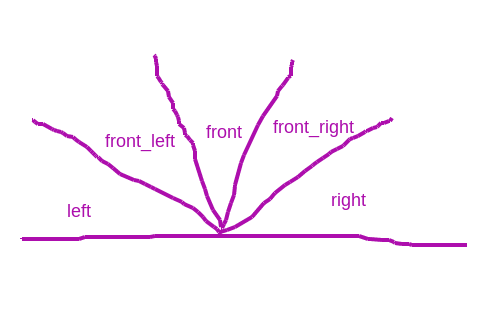
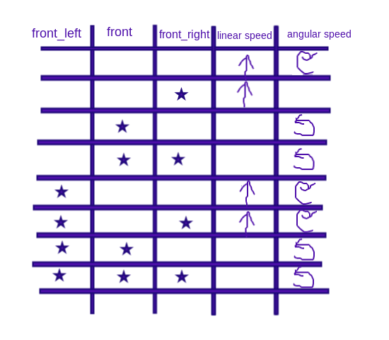
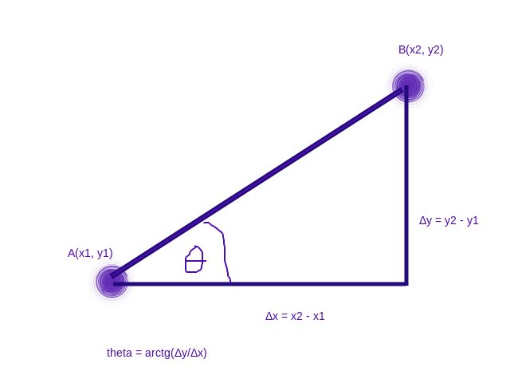
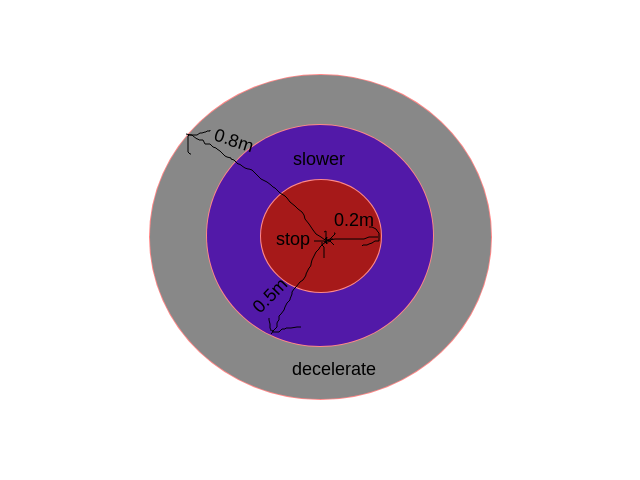
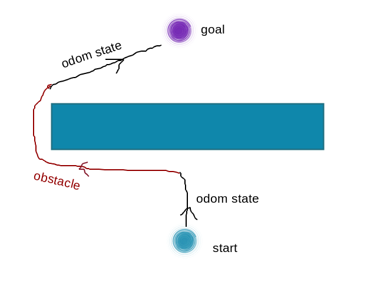
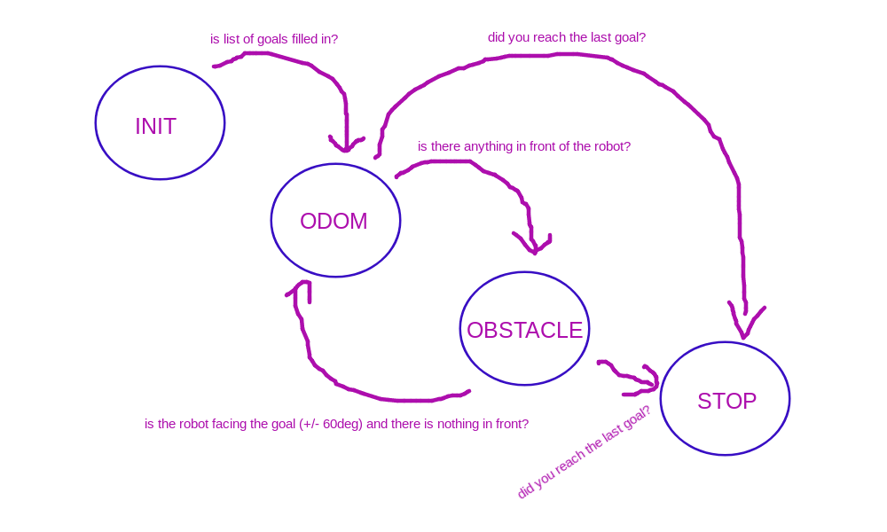

# Autonomous Mobile Robots Final Project
Author: Dominik Mazniak, 30171

Course: AMR / SS2018

Date: 20.08.18

## Introduction
This repository stores the ROS program for navigation between given points while avoiding obstacles.<br/>
The robot is starting from (0,0) point. <br/>
It has to reach 3 goals published on the given topic + obstacles avoidance.

**Topics which I am going to subscribe to:**

`/gazebo/model_states` - to obtain the exact position of the robot. Message: `ModelStates`

`/goals` - to  get the goals (6 floats, 3 points). Message: `Float32MultiArray`

`/laserscan` - to get the laser data. Message: `LaserScan` <br/>

**Topic which I am going to publish to:**

`/mobile_base/commands/velocity` - to get the laser data. Message: `Twist` <br/>

**Nodes:** <br/>

`autonomy` - one node which executes the program

## Keywords
ROS, navigation, gazebo, laser scanner, odometry, state machine, class

## Algorithms

### Laser data
Laser data is divided into 5 sectors. Each sector is the minimum value within the given range of angles: <br/>


### Obstacle following <br/>
The robot is following the obstacle based on the truth table below: <br/>


### Navigation with PID<br/>

```python
        # PID controller,
        self.integral += self.angle_diff
        self.derivative = self.angle_diff - self.prev_angle_diff
        # PID controller setting up speed
        self.vel_pub.move_angular(100*(self.kp * self.angle_diff + self.ki \
         * self.derivative + self.ki * self.integral))
```
How does the robot behave when it's close to a goal?


### Bug0 algorithm <br/>
 <br/>
```python  
            fl = self.laser_sub.sectors['front_left']
            f = self.laser_sub.sectors['front']
            fr = self.laser_sub.sectors['front_right']
            l =  self.laser_sub.sectors['left']
            r =  self.laser_sub.sectors['right']
            s = self.second_threshold
            t = self.third_threshold

            if math.fabs(error_yaw) < (math.pi / 6) and f > t and fr > s and fl > s:
                self.sm_general.set_state("odom")
            if error_yaw < 0 and math.fabs(error_yaw) > (math.pi / 6) and \
                math.fabs(error_yaw) < (math.pi / 2)  and r > t and fr > s:
                self.sm_general.set_state("odom")
            if error_yaw > 0 and math.fabs(error_yaw) > (math.pi / 6) and \
                math.fabs(error_yaw) < (math.pi / 2)  and l > t and fl > s:
                self.sm_general.set_state("odom")
```
### State machines
The program consists of **2 state machines**: <br/>
The **1st** one - general state machine - keeps track of the program. The states are: <br/>
**1) init** - wait until the goals are given by the goals subscriber provided by the teacher <br/>
**2) odom** - navigate to the next goal using the odometry data. Change to 3) Obstacle when an obstacle in front (2m) is detected. <br/>
**3) obstacle** - avoid obstacle. Change to 2) Odom when there is nothing in front and the robot is facing the goal (+/- 60deg) <br/>
**4) stop** - stop the program after it reached the last goal.



The **2nd** one - avoiding obstacle state machine - allows the robot to follow the obstacles. The states are: <br/>
**1) find_obstacle** - turn right when nothing detected <br/>
**2) turn_left** - turn left to avoid obstacle <br/>
**3) follow_obstacle** - follow the obstacle <br/>


## Program structure
The program is written object oriented. The main, Autonomy class includes:
1) `LaserSubscriber` - `self.laser_sub` <br/>
2) `OdomSubscriber`- `self.odom_sub` <br/>
3) `GoalsSubscriber`  - `self.goals_sub` <br/>
4) `VelocityPublisher` - `self.vel_pub` <br/>
5) `StateMachine` objects. - `self.sm_general` - contains general state machine<br/>
No encapsulation has been used (no setters nor getters). <br/>
`start.launch` file starts the scripts which measure distance and activate goals.
 It also sets rosparams for PID gains and loop frequency.

## Conclusion
The bug0 algorithm works well in the given world. However, there are cases where the algorithm is not going to terminate. That's why bug1 or bug2 algorithms might be better for more complex obstacles.
 <br/>
Gazebo simulation <br/>
## Sources:
*  www.theconstructsim.com/
*  http://home.elka.pw.edu.pl/~mmajchro/praca_magisterska/magisterka.pdf
